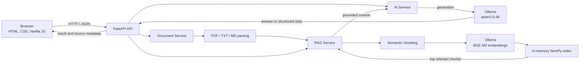

# AI Study Assistant

AI Study Assistant is a bilingual, local-first learning web application that combines local LLM inference, structured study workflows, document processing, and retrieval-augmented generation without a paid AI API dependency.

## Why I Built This

This project explores practical AI in education beyond generic chat. It combines focused learning workflows with local model inference, safe structured outputs, and document-grounded question answering. The architecture also provides a compact way to learn the engineering behind local LLM applications and RAG while keeping the system understandable enough to inspect end to end.

## Features

- **AI Chat** — English and Simplified Chinese conversations with recent multi-turn context.
- **Explain** — one-shot explanations in Simple, Detailed, or With Example styles.
- **Quiz** — five AI-generated multiple-choice questions with Easy, Medium, or Hard difficulty, validated structure, deterministic Python scoring, and explanations.
- **Study Plan** — personalized, validated 7-day or 30-day plans based on a goal, current level, and daily time budget.
- **Documents** — local extraction and preview for PDF, UTF-8 TXT, and Markdown files.
- **Local RAG** — multilingual embeddings, semantic retrieval, grounded answers, and source attribution over selected documents.

The interface and generated content can switch between English and Simplified Chinese.

## Local-First, No Paid AI API Dependency

All AI work is designed to run on the user's computer:

- **Generation:** Ollama with `qwen3.5:4b`
- **Embeddings:** Ollama with `bge-m3`
- **Retrieval:** exact cosine similarity over normalized NumPy vectors
- **Document processing:** local PDF/TXT/Markdown parsing

No OpenAI, Claude, or Gemini API key is required. The OpenAI Python SDK is used only as an OpenAI-compatible client pointed at the loopback Ollama endpoint; it does not contact OpenAI in the default configuration. Model downloads, suitable hardware, electricity, and an internet connection for initial setup still have real-world costs.

## Architecture



The frontend owns view state and current chat history. FastAPI validates requests and separates AI generation, document parsing, and retrieval into focused services. Quiz sessions, parsed documents, chunks, and embeddings are temporary in-process state.

For a deeper explanation, see [Architecture](docs/ARCHITECTURE.md).

## RAG Pipeline

**Indexing**

`document → parse → semantic chunks → BGE-M3 embeddings → normalized in-memory NumPy vectors`

**Question answering**

`question → BGE-M3 embedding → cosine similarity → top relevant chunks → grounded prompt → Qwen3.5 → answer + sources`

Only retrieved excerpts are sent to the generation model. If no chunk passes the relevance threshold, the API returns an insufficient-evidence response instead of answering from general model knowledge. Documents and their indexes exist only in memory and disappear when FastAPI restarts.

## Technology Stack

| Area | Technology |
| --- | --- |
| Frontend | HTML, CSS, Vanilla JavaScript |
| Backend / validation | Python, FastAPI, Pydantic |
| Local generation | Ollama, Qwen3.5 4B |
| Local embeddings | Ollama, BGE-M3 |
| Retrieval | semantic-text-splitter, NumPy cosine similarity |
| Document parsing | pypdf, local UTF-8 text parsing |
| Model client | OpenAI Python SDK against local Ollama only |
| Development server | Uvicorn |

## Project Structure

```text
app/
├── main.py               # FastAPI routes and request validation
├── ai_service.py         # Ollama generation, embeddings, prompts, and AI errors
├── document_service.py   # Safe PDF/TXT/MD parsing and temporary documents
└── rag_service.py        # Chunking, indexing, retrieval, and source metadata
frontend/
├── index.html            # Semantic application views
├── style.css             # Responsive product layout
└── script.js             # Bilingual UI, API calls, state, and safe rendering
docs/                     # Architecture, testing, deployment, and portfolio notes
examples/                 # Non-sensitive sample material for RAG testing
requirements.txt          # Direct Python runtime dependencies
.env.example              # Safe local configuration template
```

## Quick Start

### Prerequisites

- Git
- Python 3.12 recommended (the release candidate is tested with Python 3.12)
- [Ollama](https://ollama.com/download)

The current Ollama model files are approximately 3.4 GB for Qwen3.5 4B and 1.2 GB for BGE-M3 before runtime overhead. Inference speed depends on the local CPU/GPU and available memory.

### 1. Clone and create an environment

```bash
git clone https://github.com/yushuaiyuan618-web/ai-study-assistant.git
cd ai-study-assistant
python -m venv .venv
```

Activate it on Windows PowerShell:

```powershell
.\.venv\Scripts\Activate.ps1
```

Or on macOS/Linux:

```bash
source .venv/bin/activate
```

Install the Python dependencies:

```bash
python -m pip install -r requirements.txt
```

### 2. Prepare Ollama

Ensure Ollama is running, then download both required models:

```bash
ollama pull qwen3.5:4b
ollama pull bge-m3
```

If the Ollama application did not start its service automatically, run `ollama serve` in a separate terminal.

### 3. Configure the application

Copy the safe local template:

```powershell
# Windows PowerShell
Copy-Item .env.example .env
```

```bash
# macOS/Linux
cp .env.example .env
```

The defaults already select local Ollama, `qwen3.5:4b`, `bge-m3`, and retrieval top-k 4. Do not commit `.env`.

### 4. Start the application

```bash
python -m uvicorn app.main:app --reload
```

You can also use `start.bat` on Windows or `sh start.sh` on macOS/Linux. These helpers only start FastAPI; they do not install software or download models.

Open [http://127.0.0.1:8000/](http://127.0.0.1:8000/). The health endpoint is [http://127.0.0.1:8000/api/health](http://127.0.0.1:8000/api/health).

## Two-Minute First Run

1. In **AI Chat**, ask: `Explain gradient descent simply.`
2. In **Quiz**, use the topic: `Python lists`.
3. In **Documents**, upload `examples/sample_study_notes.txt`.
4. Ask: `Why should the validation set be separate from the test set?`
5. Confirm that the answer includes a **Sources** section referring to the sample file.

For a shorter tester-focused walkthrough, see [Tester Guide](docs/TESTER_GUIDE.md).

## Engineering Decisions

- **Ollama** keeps inference local and exposes a stable API without coupling the frontend to a model runtime.
- **Qwen3.5 4B** provides a practical local size and bilingual capability for this portfolio scope.
- **BGE-M3** supplies multilingual embeddings for English/Chinese retrieval.
- **NumPy retrieval** is easier to inspect than a vector database and is sufficient for the deliberate 10-document in-memory limit.
- **FastAPI and Pydantic** keep API contracts and untrusted structured model output explicit.
- **Vanilla JavaScript** keeps the learning UI lightweight and makes state transitions visible without a framework.
- **In-memory storage** avoids premature database complexity in v1; persistence is a documented future boundary.

## Open Source and Project-Specific Work

The project intentionally integrates mature open-source tools rather than claiming to create the underlying models or libraries.

**Reused:** Ollama, Qwen3.5, BGE-M3, FastAPI, pypdf, semantic-text-splitter, NumPy, and the OpenAI-compatible Python client.

**Project-specific engineering:** provider integration, bilingual learning workflows, bounded multi-turn context, structured Quiz and Study Plan validation, deterministic grading, document ingestion, local RAG orchestration, source attribution, trust boundaries, frontend state, safe rendering, and responsive UX.

See [Open-Source Acknowledgements](docs/OPEN_SOURCE.md) for licenses and links.

## Current Limitations

- Ollama and both models must be installed locally; speed depends on the user's hardware.
- Chat history, quiz sessions, plans, documents, and the RAG index are not persistently stored.
- Restarting FastAPI removes uploaded documents and embeddings; refreshing the page removes frontend-only state.
- PDF support extracts embedded text only; scanned/image-only PDFs require OCR, which is not included.
- Uploads are limited to PDF, UTF-8 TXT, and Markdown, with at most 10 temporary documents of 10 MB each.
- Retrieval uses an exact in-memory search and has not been benchmarked for production-scale corpora.
- Generated learning content can still be incorrect and should be reviewed for high-stakes study.
- There is currently no hosted public demo; the architecture is best represented through local testing.

## Future Work

- Persistent user and document storage
- OCR and additional study-material formats
- Retrieval evaluation, reranking, and larger-corpus indexing
- Automated quality benchmarks for learning content and RAG grounding
- Adaptive learning analytics based on validated study activity

## Documentation

- [Architecture](docs/ARCHITECTURE.md)
- [Tester Guide](docs/TESTER_GUIDE.md)
- [Deployment Research](docs/DEPLOYMENT.md)
- [Open-Source Acknowledgements](docs/OPEN_SOURCE.md)
- [Portfolio and Interview Material](docs/PORTFOLIO.md)

## License Status

A project-level license has not yet been selected. Until the repository owner adds one, the original project code is not automatically licensed for reuse. Third-party projects and models retain their own licenses; see [Open-Source Acknowledgements](docs/OPEN_SOURCE.md).
