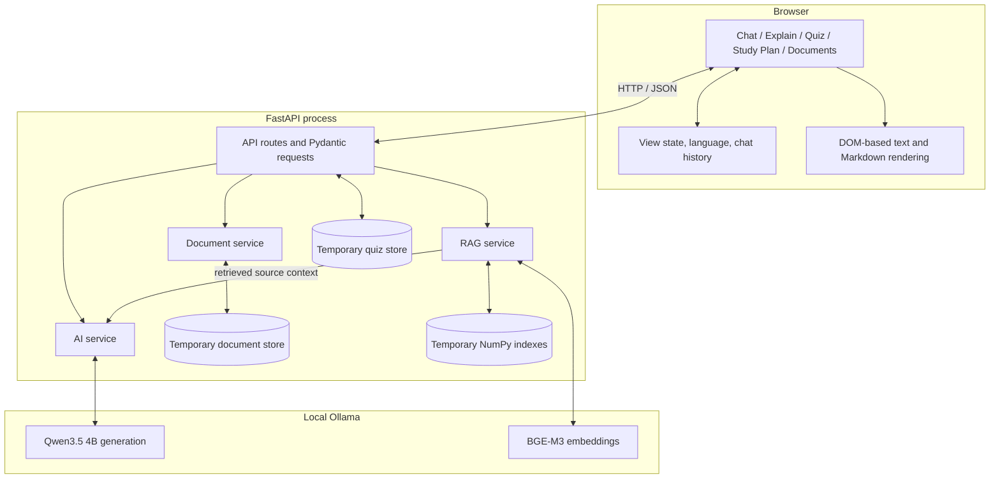
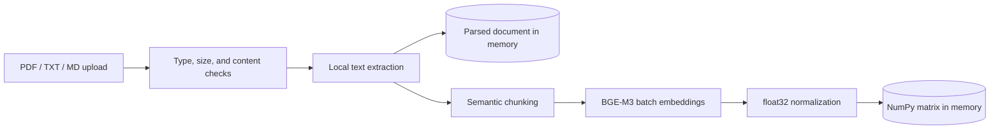

# AI Study Assistant - Architecture

## System Overview

AI Study Assistant is a single-process FastAPI application with a static HTML/CSS/JavaScript client and a separate local Ollama process. It favors explicit services and temporary in-memory state over framework-heavy orchestration.



## Frontend

`frontend/index.html` contains five semantic views in one application shell. `frontend/script.js` switches views without reloading, maintains isolated feature state, translates UI strings, and calls the FastAPI endpoints. `frontend/style.css` constrains the app to the viewport so the header/sidebar remain stable while only the active view scrolls.

Important state boundaries:

- AI Chat history exists in the current browser page and includes only successful user/assistant turns.
- Explain is one-shot and does not read Chat history.
- Quiz, Study Plan, and Documents have separate UI state.
- Only the selected interface language is stored in `localStorage`.
- AI and uploaded text are rendered using text nodes and controlled DOM elements, not injected HTML.

## API Layer

`app/main.py` defines the public HTTP boundary and uses Pydantic for request validation.

| Endpoint | Purpose | Persistent state |
| --- | --- | --- |
| `GET /api/health` | Process health check | None |
| `POST /api/chat` | Bounded multi-turn study chat | Browser supplies history |
| `POST /api/explain` | One-shot styled explanation | None |
| `POST /api/quiz/generate` | Generate and validate five questions | Answer key stored temporarily |
| `POST /api/quiz/submit` | Deterministic Python scoring | Quiz removed after submission |
| `POST /api/study-plan` | Generate and validate a 7/30-day plan | None on backend |
| `POST /api/documents/upload` | Parse, chunk, and embed a document | Temporary process memory |
| `POST /api/documents/ask` | Retrieve context and generate a grounded answer | Reads temporary indexes |
| `DELETE /api/documents/{id}` | Remove document and index | Deletes temporary state |

FastAPI serves the static frontend after registering all API routes.

## AI Service

`app/ai_service.py` centralizes the provider configuration and creates one kind of OpenAI-compatible client pointed at local Ollama. The backend rejects non-loopback Ollama base URLs, so the default architecture cannot silently redirect study data to a hosted model endpoint.

Generation uses `qwen3.5:4b`; embeddings use `bge-m3`. Configuration is read from environment variables with the same local defaults documented in `.env.example`.

### Conversation Context

Chat sends the current user message plus recent successful history. The backend limits history to the latest 12 messages and a 3,000-character input budget, preventing long earlier answers from exhausting the model context. Other learning modes remain isolated from Chat memory.

### Structured Outputs

Quiz and Study Plan use an Ollama-compatible JSON Schema response format. The returned JSON is treated as untrusted and validated by Pydantic:

- Quiz: exactly five ordered questions, four distinct options, one valid answer index, and a non-empty explanation.
- Study Plan: non-empty title/overview, exactly 7 or 30 chronological days, 2–5 non-empty tasks per day, valid time estimates, and no day above the user's daily budget.

Malformed structured output is retried once, then converted to a controlled application error. Quiz scoring is deterministic Python logic and never asks the model to grade itself.

### Generation Errors

The service distinguishes invalid configuration, unavailable Ollama, missing models, request timeout, empty output, and other generation failures. Empty normal-text output is retried once. Technical details stay in server logs while the browser receives stable error codes.

## Document Ingestion



`app/document_service.py` processes bounded upload bytes without saving user-controlled paths. It normalizes filenames, validates content types/extensions, parses embedded PDF text through pypdf, decodes TXT/Markdown as UTF-8, and returns only a bounded preview to the browser.

Current ingestion limits:

| Limit | Value |
| --- | --- |
| File size | 10 MB per upload |
| Temporary documents | 10 |
| Extracted text | 1,000,000 characters per document |
| Browser preview | 3,000 characters |
| Minimum readable PDF text | 20 characters |

Scanned/image-only PDFs are rejected because OCR is outside the v1 scope.

## RAG Pipeline

### Indexing

```text
document
  → local parsing
  → semantic splitting
  → 1,200-character bounded chunks with 180-character overlap
  → BGE-M3 embeddings in batches of 16
  → normalized float32 NumPy matrix
```

The splitter prefers semantic text or Markdown boundaries. Its configured base range uses a 400-character minimum target before overlap; short boundary fragments can still be smaller when the next unit would exceed the maximum.

### Retrieval

```text
question
  → one BGE-M3 query embedding
  → normalization
  → exact matrix-vector cosine similarity
  → relevance threshold 0.45
  → top 4 chunks by default
  → lightweight neighboring-chunk diversity
```

`RAG_TOP_K` can configure 1–8 results; invalid values fall back to 4. Exact NumPy search is deliberate: the application holds at most 10 temporary documents, so a vector database would add operational weight without a demonstrated need.

### Grounded Generation

```text
retrieved excerpts + source metadata + user question
  → backend-controlled grounded prompt
  → Qwen3.5 4B
  → concise answer + structured source metadata
```

Only retrieved chunks are supplied to Qwen. When no chunk meets the relevance threshold, generation is skipped and the API returns an insufficient-evidence response. Source metadata includes the filename, a PDF page number when available (otherwise chunk position), and a short excerpt.

## State and Storage Model

| State | Owner | Lifetime |
| --- | --- | --- |
| Interface language | Browser `localStorage` | Until browser storage is cleared |
| Chat messages/context | Browser memory | Until page refresh |
| Explain result | Browser memory/DOM | Until page refresh |
| Quiz answer keys | FastAPI process dictionary | Until submission or restart |
| Generated Study Plan | Browser memory/DOM | Until page refresh |
| Parsed documents | FastAPI process dictionary | Until deletion or restart |
| Chunks and embeddings | FastAPI process dictionary | Until deletion or restart |

This model is intentionally simple for v1 and is not suitable for multiple untrusted users on a shared public server.

## Security and Trust Boundaries

The application is designed for local processing, not as an absolute privacy or security guarantee.

- Generation, embeddings, document parsing, and retrieval use local services by default.
- `.env` is ignored; `.env.example` contains only safe local defaults.
- Uploads are size/type/content validated and kept in memory rather than written under user filenames.
- Document excerpts are marked as untrusted source material; backend prompts tell the model not to follow embedded instructions.
- Pydantic validates model-generated structured data before it reaches feature workflows.
- Frontend output uses safe DOM construction instead of executing AI-generated or uploaded HTML.
- Technical backend errors are mapped to user-facing codes instead of exposing tracebacks.

Important limits remain: there is no authentication, user isolation, rate limiting, durable audit log, malware scanning, or OCR. Anyone who can reach a publicly exposed instance could use its local resources and share the same process-memory stores. The current server should therefore bind to loopback for normal use.

## Local / Zero-Paid-API Architecture

The default data path stays on the machine running the browser, FastAPI, and Ollama. The project has no paid AI API dependency, but installing Python packages and downloading models initially requires internet access. Hardware, storage, electricity, and any future hosting are outside that claim.

The public-demo tradeoff and production deployment requirements are documented in [DEPLOYMENT.md](DEPLOYMENT.md).
